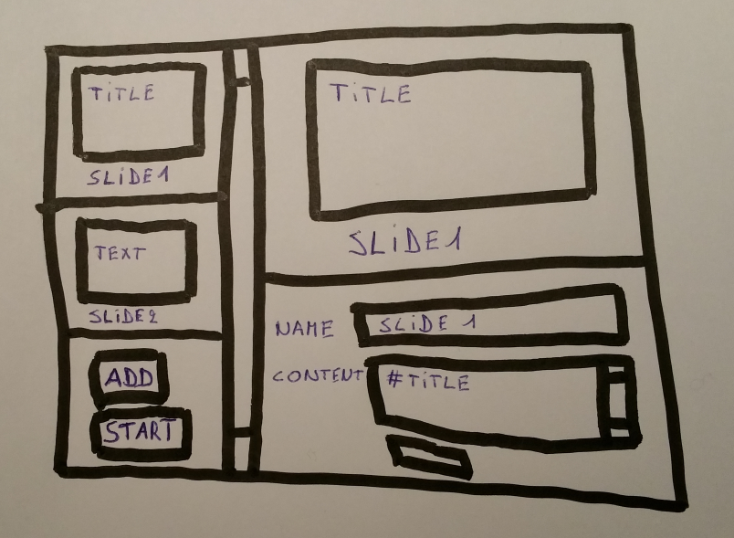
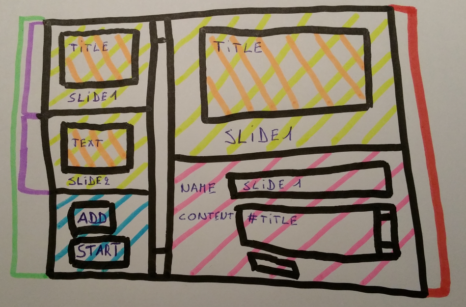

# React demo

## Mock

## Identify components

## [Build pipeline](buildpipeline)

## [Static version](staticversion)

## [Data flow](dataflow)

## Continuous integration (extra)

## Continuous delivery (extra)